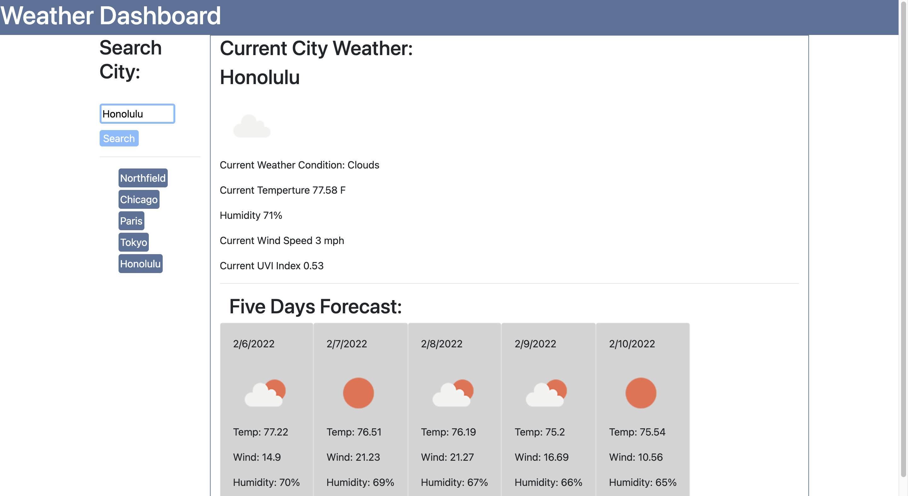

# Weather-Dashboard-API
 
 This is project was assignment to me as part of the University of Minnesota Web Development Bootcamp.  The goal of the project was to be able to fetch from an open source weather third party API then populate data from in a weather dashboard.  You where also ment to intergrate local storage to storage past search results.  

 ## Requirements:

-App does present current conditions for the searched city and that city is added to Local Storage
-App does does present current City Name, Weather Conditions, date, icon for weather conditions, temperature, humidity, wind speed and UV index
-App does NOT present color that indicates weather if conditions are favorable, moderate or severe... I could not find that from the data shared in the API
-App does present the NEXT five day forecast with date, icon of weather condidions, temperature, wind speed and humidity
-When a user clicks on the a City in the Search History data from that City and Next 5 day forecast populates.

## General Reflections:

I'm pretty proud of this app.  I started with 0 code with this and wrote it all.  Outside of a bit of help with learning how to display the icons and help with local storage it was all me. Feel like the appearance of the APP closely matches the mockup.  It is clean and looks good.  Just missing the color code with the conditions.  But over all it's great and pround to have it in my repo.

### Link to App
<a href="https://danielp1742.github.io/weather-dashboard-api/">Git Page</a>

### Images

